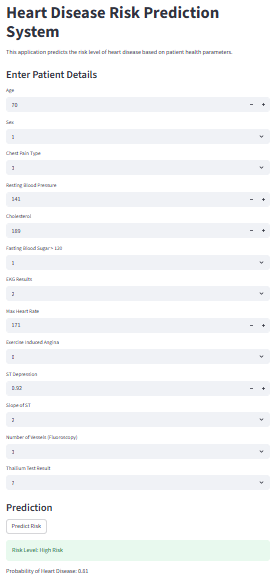

# Heart Disease Risk Prediction System

A machine learning-based healthcare prediction system designed to assess heart disease risk using patient health parameters.

## Overview

This project uses machine learning classification algorithms to predict the probability of heart disease based on clinical attributes such as blood pressure, cholesterol, age, and heart rate.

The system categorizes predictions into Low, Medium, and High risk levels to improve interpretability and support early healthcare risk assessment.

---

## Features

* Machine learning-based heart disease prediction
* Comparative evaluation of multiple classification models
* Risk-level categorization
* Real-time prediction interface using Streamlit
* Healthcare data preprocessing and feature scaling

---

## Tech Stack

* Python
* Scikit-learn
* Pandas
* NumPy
* Streamlit

---

## Models Used

* Logistic Regression
* Decision Tree Classifier
* Random Forest Classifier

---

## Results

* Achieved approximately 90% prediction accuracy using Logistic Regression
* Implemented Low / Medium / High risk-level classification
* Developed an interactive Streamlit interface for prediction visualization

---

## Project Structure

```text
heart-disease-risk-prediction/
│
├── src/
├── screenshots/
├── docs/
└── README.md
```

---

## Screenshots

### Prediction Interface



### Risk Prediction Output


---

## Future Enhancements

* Integration with real-time healthcare datasets
* Deployment as a web/mobile application
* Explainable AI integration
* Advanced deep learning models

---

## Disclaimer

This project is intended for educational and decision-support purposes only and is not a replacement for professional medical diagnosis.

---

## Author

Aayushi
B.Tech CSE, KIIT University
